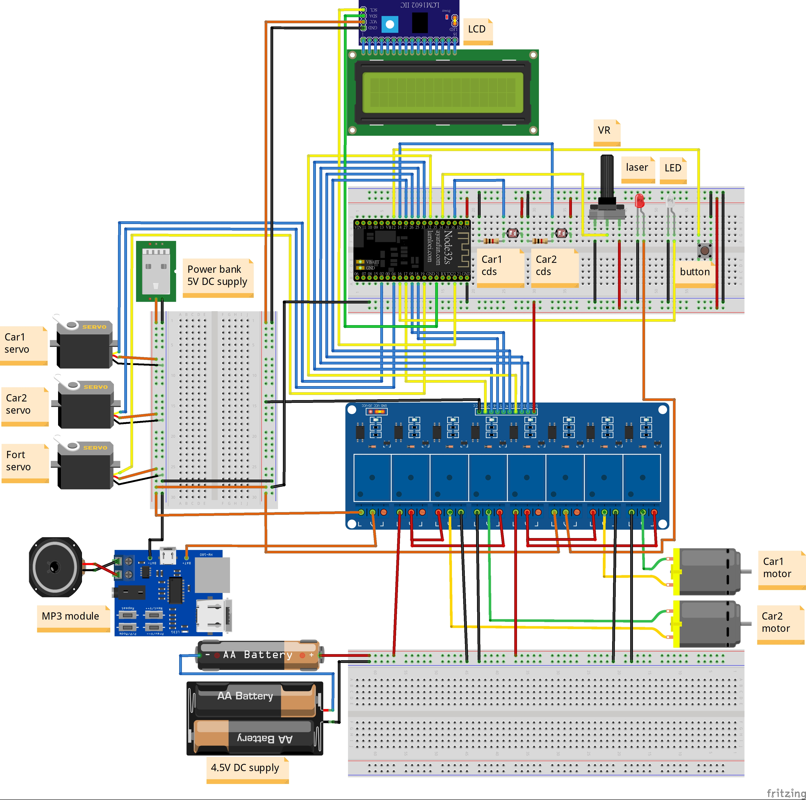

# 聖誕節雷射遊戲

## Demo 影片
### 說明影片

### 實際遊玩影片

## 電路圖

## 程式碼說明
### 炮台控制
- Method
    - `turn()`: 處理炮台的轉向
    - `shoot()`: 處理炮台的射擊
- 成員
    - `last_shoot_time`: 砲台上次射擊時間
    - `CD`: 砲台冷卻時間

### 敵人控制
- Method
    - motor_direct(): 控制敵人移動方向
    - is_shooted()：回傳敵人是否被射擊
    - kill()：敵人被射擊後需判斷
    - recovery()：恢復敵人，回到起立
- 成員
    - last_shoot_time：記錄上一次被射擊的時間
    - last_turn_state：記錄上一次方向
    - last_turn_time：記錄上一次轉方向的時間
    - Threshold：記錄光敏電阻的臨界值
    - Threshold：記錄光敏電阻的臨界值
- 遊戲控制
    - 敵人控制迴圈邏輯
        1. 判斷敵人是否被射擊
        2. 判斷敵人是否可以恢復
        3. 判斷敵人是否可以改變方向
    - 砲台控制迴圈邏輯
        1. 調整砲台角度
        2. 判斷是否是可射擊狀態
    - 遊戲迴圈
        1. 更新砲台狀態
        2. 更新敵人狀態
        3. 更新計分版狀態
    
    

